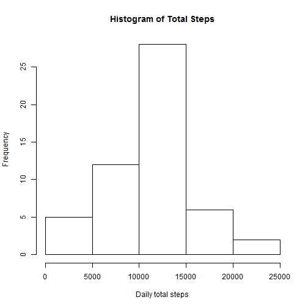
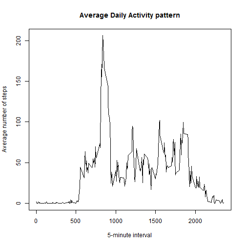
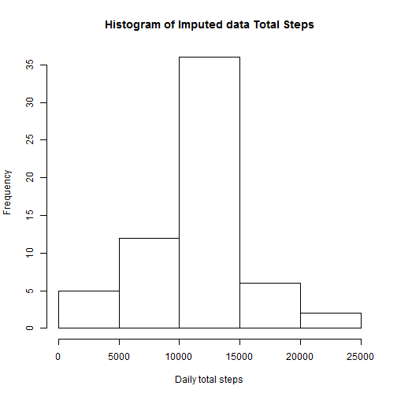
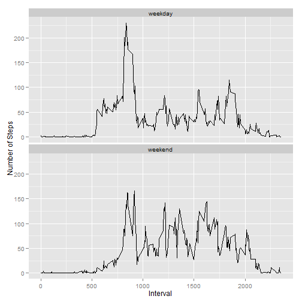

We first set the working directory to the location where we have downloaded the activity.csv file:


```r
setwd("C:/Users/Ali/Documents/Github/RepData_PeerAssessment1")
```

Load the data:


```r
data <- read.csv("activity.csv")
```

## 1. What is mean total number of steps taken per day? 

1. Code for the total number of steps taken per day: (uses dplyr package)

We first load the dplyr package:


```r
library(dplyr)
```

Then we write a code to calculate the total number of steps taken per day and we summarize it to a dataframe called 'totalSteps': 


```r
totalSteps <- summarize(group_by(data, date), totalSteps = sum(steps))
```

2. The code for a histogram of the total number of steps taken each day is shown below followed by the histogram:


```r
hist(totalSteps$totalSteps, main = "Histogram of Total Steps", xlab = "Daily total steps")
```

 


3. Code for calculating and reporting the mean and median of the total number of steps taken per day:


```r
normal_mean <- mean(totalSteps$totalSteps, na.rm = TRUE)
normal_mean <- format(round(normal_mean, 2))

normal_median <- median(totalSteps$totalSteps, na.rm = TRUE)
normal_median <- format(round(normal_median, 2), nsmall = 2)
```

The mean of total number of steps taken per day is: 10766.19
The median of total number of steps taken per day is: 10765.00

## 2. What is the average daily acitivty pattern?

1. Time series plot (i.e. type = "l") of the 5-minute interval (x-axis) and the average number of steps taken, averaged across all days (y-axis):


```r
averageSteps <- summarize(group_by(data, interval), averageSteps = mean(steps, na.rm = TRUE))

plot(averageSteps$interval, averageSteps$averageSteps, type = "l", 
     xlab = "5-minute interval", ylab = "Average number of steps", main = "Average Daily Activity pattern")
```

 

2. Which 5-minute interval, on average across all the days in the dataset, contains the maximum number of steps?


```r
filter(averageSteps, averageSteps == max(averageSteps$averageSteps))$interval
```

```
## [1] 835
```


## 3. Imputing missing values

1. Calculate and report the total number of missing values in the dataset (i.e. the total number of rows with NAs)


```r
NArows <- filter(data, is.na(steps))
NArows <- nrow(NArows)
```
The number of missing values in the Dataset is: 2304

2. Devise a strategy for filling in all of the missing values in the dataset. The strategy does not need to be sophisticated. For example, you could use the mean/median for that day, or the mean for that 5-minute interval, etc.

**Strategy**: Missing value to be replaced with mean for that 5 minute interval:

We first merge the 'averageSteps' dataframe with the 'data' dataframe. The 'averageSteps' dataframe contains the mean values for each 5 minute interval and was made for part 2 of this assigment. 


```r
data <- merge(data, averageSteps, by = "interval")
```

Then we loop through the data and replace all NA values with the average 5 minute interval values for each interval. 


```r
for (i in data){
    
    data$steps[is.na(data$steps)] <- data$averageSteps[is.na(data$steps)]
    
    }
```

Lastly, we rearrange the data in ascending date format to match the orginal data set. 

```r
data <- arrange(data, date)
```


3. Create a new dataset that is equal to the original dataset but with the missing data filled in.


```r
newData <- select(data, c(steps, date, interval))
```
The head of the new dataset 'newData' is given below:


```
##       steps       date interval
## 1 1.7169811 2012-10-01        0
## 2 0.3396226 2012-10-01        5
## 3 0.1320755 2012-10-01       10
## 4 0.1509434 2012-10-01       15
## 5 0.0754717 2012-10-01       20
## 6 2.0943396 2012-10-01       25
```

4. Make a histogram of the total number of steps taken each day and Calculate and report the mean and median total number of steps taken per day. Do these values differ from the estimates from the first part of the assignment? What is the impact of imputing missing data on the estimates of the total daily number of steps?


```r
imputedTotalSteps <- summarize(group_by(newData, date), totalSteps = sum(steps))
```


```r
hist(imputedTotalSteps$totalSteps, main = "Histogram of Imputed data Total Steps", 
     xlab = "Daily total steps")
```

 


```r
Imputed_mean <- mean(imputedTotalSteps$totalSteps, na.rm = TRUE)
Imputed_mean <- format(round(Imputed_mean, 2))
```


```r
Imputed_median <- median(imputedTotalSteps$totalSteps, na.rm = TRUE)
Imputed_median <- format(round(Imputed_median, 2))
```

The imputed mean is 10766.19 and the imputed median is 10766.19. The imputed mean remains the same as the one computed in the first part but the median changes. The median used to be 10765.00 and now is 10766.19 which happens to be the same value as the mean.


If you compare the histogram in part 1 with the imputed values histogram shown above, it is seen that the total daily number of steps have increased. 


## 4. Are there differences in activity patterns between weekdays and weekends?

For this part the weekdays() function may be of some help here. Use the dataset with the filled-in missing values for this part.

1. Create a new factor variable in the dataset with two levels - "weekday" and "weekend" indicating whether a given date is a weekday or weekend day.

A factor variable 'typeOfDay' is created which indicates if the day is a weekday or a weekend. 


```r
newData <- cbind(newData, typeOfDay = c(0))

newData$date <- as.Date(newData$date, format = "%Y-%m-%d")

newData$typeOfDay <- weekdays(newData$date)

newData$typeOfDay[newData$typeOfDay == "Monday" | newData$typeOfDay == "Tuesday" |
                      newData$typeOfDay == "Wednesday" | newData$typeOfDay == "Thursday" |
                      newData$typeOfDay == "Friday"] <- "weekday"
newData$typeOfDay[newData$typeOfDay == "Saturday" | newData$typeOfDay == "Sunday"] <- "weekend"

newData$typeOfDay <- as.factor(newData$typeOfDay)
```

2. Make a panel plot containing a time series plot (i.e. type = "l") of the 5-minute interval (x-axis) and the average number of steps taken, averaged across all weekday days or weekend days (y-axis). See the README file in the GitHub repository to see an example of what this plot should look like using simulated data.

We first split up weekday and weekend data before we take 5-minute interval averages. 


```r
weekdayData <- filter(newData, typeOfDay == "weekday")
weekendData <- filter(newData, typeOfDay == "weekend")
```

Now we take 5-minute averages for weekday and weekend data:

```r
weekdayAverage <- summarize(group_by(weekdayData, interval), averageSteps = mean(steps))
weekendAverage <- summarize(group_by(weekendData, interval), averageSteps = mean(steps))
```

Finally we plot the two time-series plots of 5-minute interval averages to differentiate between the level of acitivity on weekdays and weekends. 


```r
library(ggplot2)

weekdayAverage <- cbind(weekdayAverage, typeOfDay = "weekday")
weekendAverage <- cbind(weekendAverage, typeOfDay = "weekend")
plotData <- rbind(weekdayAverage, weekendAverage)

ggplot(plotData, aes(x = interval, y = averageSteps)) + geom_line() + facet_wrap( ~ typeOfDay, nrow = 2) + xlab("Interval") + ylab("Number of Steps")
```

 

From the graph above, we observe that ther is much more activity during the morning hours of the day on wekdays when compared to weekends while there is more acitivity in the afternoons and evenings of weekends. 
